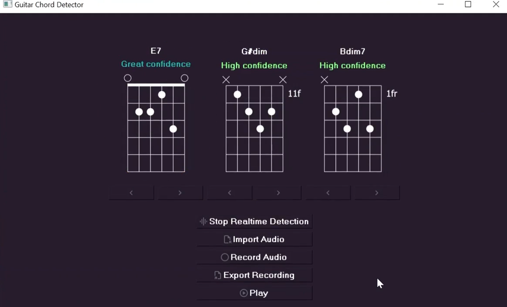

# ChordDetector: Определение гитарных аккордов из аудио


[](LICENSE)

Инструмент для определения аккордов по аудиозаписям и в реальном времени.

## 🎸 Возможности

- Анализ аудиофайлов (WAV) или запись с микрофона
- Определение трех наиболее вероятных аккордов, с указанием степени уверенности
- Показ аппликатур для гитары
- Простое интуитивное управление
- Определение 23 видов аккордов

## ⚙️ Установка

1. Клонируйте репозиторий:
```bash
git clone https://github.com/NickolayS1/ChordDetector
cd ChordDetector
```

2. Установите зависимости:
```bash
pip install -r requirements.txt
```

## 🚀 Запуск

Приложение может некорректно запускаться на Linux, из-за зависимостей библиотеки sounddevice. 
Поэтому рекомендуется использовать Windows
### Windows:
```bash
python src/main_window.py
```

### Linux/macOS:
```bash
python3 src/main_window.py
```

## 💡 Рекомендация:
Лучше использовать виртуальное окружение:
```bash
python3 -m venv venv
source venv/bin/activate  # Linux/macOS
# или 
venv\Scripts\activate    # Windows
pip install -r requirements.txt
```

## Использование

- Программа работает только с WAV-файлами. 
- При записи или загрузке аудио убедитесь, что файл содержит ровно один аккорд. 
- Запись длится 4 секунды, этого достаточно, чтобы уверенно сыграть аккорд. 
- Используя режим реального времени, старайтесь соблюдать интервал между аккордами не менее 1 секунды.
- Кнопка play проигрывает последнюю сделанную запись. В случаях, когда запись не была сделана, программа вернет ошибку.

## Как увеличить точность

Попробуйте разные способы извлечения звука:

1. Спокойный щипок всех струн аккорда  
2. Быстрый проход медиатором сверху вниз с акцентом на крайние ноты  
3. Арпеджио (последовательное извлечение нот аккорда)  

Для лучшего результата:  
- Используйте качественный микрофон  
- Записывайте в тихом помещении  
- Поддерживайте гитару в строю  
- Повторите запись 3-5 раз разными способами  
- Сравните полученные результаты определений  

## 📸 Скриншоты

- Интерфейс




